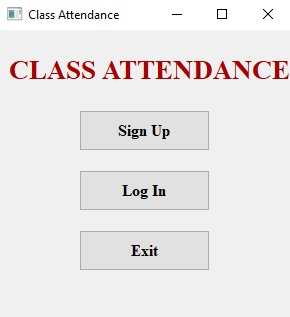
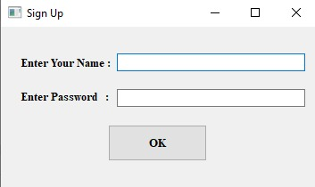
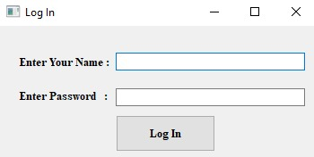
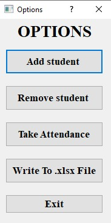
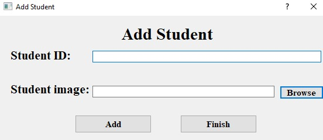
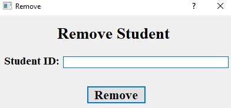
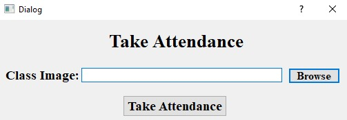
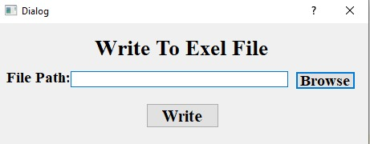

# About The Project
This is a project for machine learning course. The purpose of the project is making the class attendance process automated where the instructor will add a picture to the system for each student at the beginning of the semester then when he wants to take attendance he just takes a picture for the class and add it to the system and the system will detect the faces in the picture and  compare each face with the picture in the database. the instructor can copy the results to xlsx file
 

**Build with:**
<ul>
  <li>Language : Python 3.0</li>
  <li>libraries :</li>
  <ul>
    <li>PyQt5 for GUL</li>
    <li>face_recognition for facial recognition</li>
  </ul>
  <li>database: SQLite</li>
</ul>

# How To Use
1. Open the Main Window 
 
2. Sign Up 
 
3. Login 
 
4. After you login you will see the options page 
 
5. You can add new student 
 
6. You can remove student 
 
7. You can add the class picture for taking attendance 
 
8. You can write the results of calss attendance to clsc file 
 
